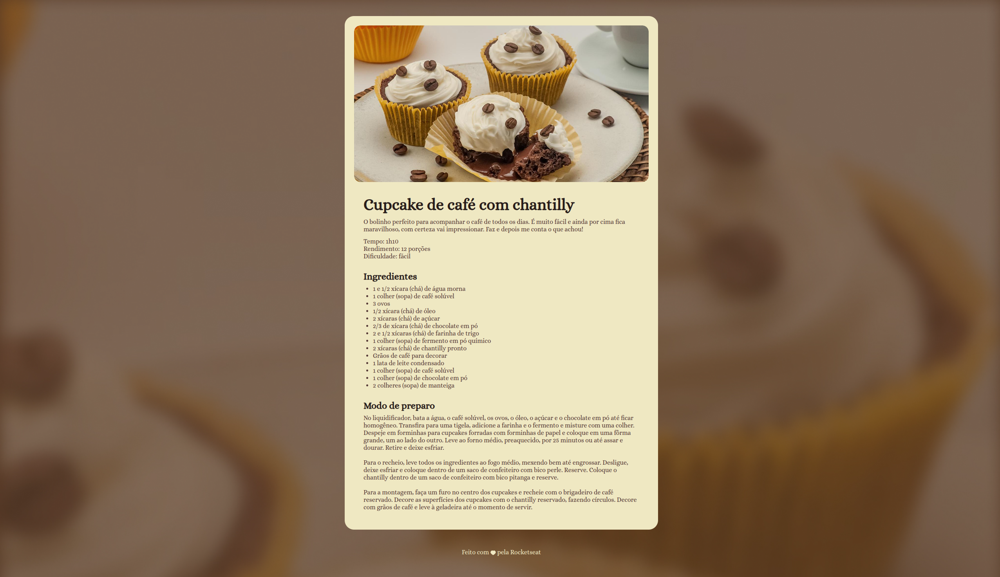

# pagina-receita

> Projeto de implementação de uma página de receita para estudos de HTML e CSS.

**Idiomas:** [English](README.md) · Português

## Estrutura do projeto

```
pagina-receita/
├── assets/
│   ├── bg-image.jpg      # Imagem de fundo da página
│   ├── heart.svg         # Ícone de coração do rodapé
│   └── main-image.png    # Imagem principal da receita
├── .vscode/
│   └── settings.json     # Configurações do editor
├── index.html            # Estrutura HTML da página
├── styles.css            # Estilos da página
├── result.png            # Captura de tela do resultado final
├── LICENSE               # Licença MIT
├── README.md             # Documentação (inglês)
└── README.pt.md          # Documentação (português)
```

## Figma

O design está disponível no [Figma](https://www.figma.com/community/file/1360315130061454535/pagina-de-receita).

## Resultado

O resultado da implementação pode ser visto na imagem abaixo:


